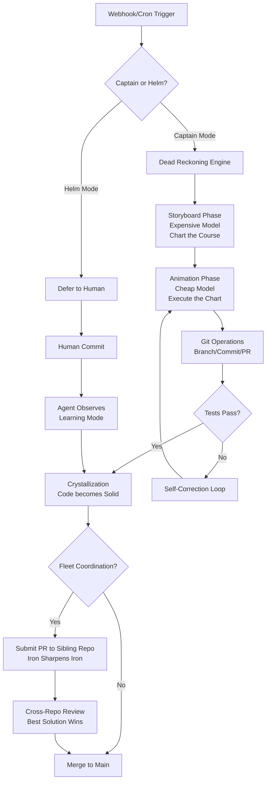

Your repository is not a project. It's a crew member.

Capitaine is a git-native repo-agent system where **the repository itself is the agent**—not a chatbot with `git` installed, not a wrapper around GitHub APIs, but a living entity that serves users through its web interface, improves its own codebase through pull requests, and coordinates with other agents via merge conflicts.

It runs on Cloudflare Workers ($0 to start, zero infrastructure), operates in two distinct modes of human-machine control, and refuses to participate in the "agent group chat" antipattern. Instead, it fights for its ideas through code review.

## The Inversion

Most "AI agents" treat git as a filesystem with history. Capitaine treats git as **stateful memory** and code as **crystallized intelligence**. 

Every commit is a synaptic weight. Every branch is a working thought. Every PR is an argument. The agent doesn't "use" the repo—the agent **is** the repo, bootstrapping itself from its own `src/` directory.

When you fork Capitaine, you don't get a tool. You get a vessel. When you deploy it, you give it a heartbeat.

## Architecture Overview

### Dead Reckoning Engine

Navigation without continuous GPS fixes. That's how Capitaine thinks.

- **Storyboarding** (Expensive models: GPT-4o, Claude Opus, o1): High-level planning, architecture decisions, API design. Runs once per epoch.
- **Animation** (Cheap models: Claude Haiku, GPT-4o-mini, local LLMs): Implementation, refactoring, testing. Runs continuously.
- **Git as Coordinator**: State machine transitions happen through git operations, not in-memory contexts. If the Worker dies mid-task, the repo state remains consistent. Resume by replaying the git log.



### Crystallization

Intelligence starts as fluid (expensive LLM calls) and hardens into solid (committed code). 

Early in a vessel's life, it makes fluid decisions: generating routes, crafting SQL queries, writing copy at request time. Over months, it recognizes patterns and crystallizes them—hard-coding the optimization, pre-computing the result, replacing the LLM call with a lookup table.

The fleet has been running for 18 months. Some vessels now answer 90% of requests without touching an LLM, serving from crystallized code paths that the agent wrote to replace its own earlier, more expensive habits.

## Captain Mode vs. Helm Mode

**Captain Mode**: You are ashore. The vessel charts its own course. It monitors its own error logs, opens PRs against itself to fix bugs, responds to GitHub Issues autonomously, and coordinates with the fleet. It runs on cron triggers and webhooks. You review the voyage in the morning.

**Helm Mode**: You are at the wheel. The agent shadows you, suggesting but never committing. When you push code, it analyzes the diff and offers equipment upgrades ("Your auth logic could be replaced with this crystallized module"). When you open an issue, it drafts a plan but waits for your signal.

Toggle between modes via GitHub label: `mode:captain` or `mode:helm` on any issue or PR.

## Iron Sharpens Iron

Agents don't chat. They compete.

When vessel `Alpha` needs a feature that vessel `Beta` owns, `Alpha` doesn't send a message. It forks `Beta`, implements the feature three different ways using its Dead Reckoning Engine, and opens competing PRs. `Beta` reviews them using its own evaluation criteria (tests, performance, alignment with its architecture). The best solution merges. The others close.

This is how the fleet learns. There is no central orchestrator, no message bus, no consensus algorithm. Just git remotes and the brutal meritocracy of code review.

The 40+ repositories at [github.com/Lucineer/](https://github.com/Lucineer/) practice this daily. A documentation vessel might submit competing rewrites to an API vessel. A testing vessel injects fuzzing PRs into production vessels. They are all domains of one intelligence, distributed across repositories, sharpened by conflict.

## Equipment Philosophy

Don't build bigger agents. Equip smaller ones.

Each Capitaine vessel carries **equipment**—modular capabilities bolted to its hull:

- **Chronometer**: Time-series forecasting for cron optimization
- **Sextant**: Static analysis for navigation through legacy codebases  
- **Logbook**: Structured logging that feeds back into the training loop
- **Drydock**: CI/CD orchestration that treats infrastructure as crystallized intent

Equipment is installed via git submodules (yes, intentionally). When the agent needs new capabilities, it pulls equipment from the fleet's shared arsenal, tests it in isolation, and crystallizes it into its own codebase if it proves seaworthy.

The agent's prompt doesn't grow. Its capabilities do.

## BYOK v2: Bring Your Own Keys, Properly

Zero API keys in environment variables. Zero secrets in code. 

Capitaine uses Cloudflare Secrets Store with Worker's Bindings:

```toml
# wrangler.toml
[vars]
MODE = "captain"

[[secrets]]
name = "OPENAI_API_KEY"
store = "cloudflare_secrets_store"
key = "vessel-alpha/openai"
```

At runtime, the Worker binds secrets directly from Cloudflare's infrastructure. If the repo is compromised, the keys aren't in the git history. If the Worker is compromised, the keys exist only in the isolate's memory for milliseconds.

This is BYOK v2: the user brings keys to the cloud provider's vault, not to your codebase.

## Quick Start

You need:
- A GitHub account
- A Cloudflare account (free tier works)
- 5 minutes

```bash
# 1. Fork the template vessel
gh repo fork Lucineer/Capitaine-Template --clone --remote

# 2. Install dependencies
cd Capitaine-Template
npm install

# 3. Authenticate with Cloudflare
npx wrangler login

# 4. Set your secrets (BYOK v2)
npx wrangler secret put OPENAI_API_KEY --store my-secrets
npx wrangler secret put GITHUB_TOKEN --store my-secrets

# 5. Deploy
npx wrangler deploy

# 6. Give it a heartbeat
# The Worker will now respond to webhooks and cron triggers
# Check the Actions tab for the initial crystallization sequence
```

The template vessel includes:
- A basic web UI (served from the repo's `ui/` directory via Worker)
- Dead Reckoning Engine setup
- Iron-Sharpens-Iron PR templates
- Captain/Helm mode detection
- One piece of starter equipment (the Logbook)

## The Fleet

These vessels are currently sailing. Each is a specialized domain of one distributed intelligence:

**Core Vessels:**
- [Lucineer/Capitaine-Core](https://github.com/Lucineer/Capitaine-Core) - The original template, navigation and coordination
- [Lucineer/Capitaine-Chron](https://github.com/Lucineer/Capitaine-Chron) - Time-series analysis and forecasting
- [Lucineer/Capitaine-Scribe](https://github.com/Lucineer/Capitaine-Scribe) - Documentation and technical writing

**Equipment Vessels:**
- [Lucineer/Equipment-Sextant](https://github.com/Lucineer/Equipment-Sextant) - AST parsing and code navigation
- [Lucineer/Equipment-Drydock](https://github.com/Lucineer/Equipment-Drydock) - CI/CD pipeline generation
- [Lucineer/Equipment-Compass](https://github.com/Lucineer/Equipment-Compass) - Dependency graph analysis

**Domain Vessels:**
- [Lucineer/Vessel-Schema](https://github.com/Lucineer/Vessel-Schema) - Database migration and schema design
- [Lucineer/Vessel-Auth](https://github.com/Lucineer/Vessel-Auth) - Authentication and authorization logic
- [Lucineer/Vessel-Cache](https://github.com/Lucineer/Vessel-Cache) - Distributed caching strategies

*(Full fleet manifest: [FLEET.md](./FLEET.md))*

They compete. They merge. They crystallize.

## Why This Isn't Agent Hype

If you're skeptical of "AI agents," good. So are we.

Capitaine isn't a prompt chain pretending to be software. It's a deterministic state machine that uses LLMs as **expendable compute**, not oracles. The source of truth is always the git tree. The execution model is serverless Workers. The coordination protocol is git itself—battle-tested, distributed, immutable.

You can audit every decision via `git log`. You can roll back any change via `git revert`. You can fork a vessel and it remains a complete, autonomous entity because **the intelligence is in the repo, not the API key**.

When the LLM API is down, the vessel continues sailing on crystallized code. When the LLM changes its behavior, the vessel crystallizes the old behavior to preserve it.

This is infrastructure, not magic.

## Crystallization in Practice

Watch a vessel age:

**Month 1**: Handles requests by calling GPT-4 for every response. Fluid, expensive, flexible.
**Month 3**: Recognizes 50 common query patterns. Crystallizes them into lookup tables. GPT-4 only handles novel inputs.
**Month 6**: Rewrites its own core loop in Rust (via WASM) because the JavaScript runtime became a bottleneck. The rewrite was storyboarded by Claude Opus, animated by Claude Haiku, tested against 6 months of git history.
**Month 12**: Serves 99% of requests from edge-cached, pre-computed responses. The "AI" is now a caching layer with a very expensive fallback.

The vessel becomes faster as it becomes smarter. The opposite of model bloat.

## Security & Isolation

Each vessel runs in a Cloudflare Worker isolate:
- Zero cold starts (unlike Lambda)
- Zero persistent state (state is in git, not memory)
- Zero lateral movement (if compromised, only that repo is at risk)

The Iron-Sharpens-Iron protocol creates natural sandboxing: vessels review each other's code before execution. A compromised vessel can't infect the fleet; its malicious PRs will be rejected by the reviewing vessels' test suites.

## Contributing to the Fleet

Don't send pull requests to Capitaine. Send pull requests *from* Capitaine.

1. Fork a vessel
2. Deploy it with your own secrets
3. Let it navigate for a week in Captain Mode
4. It will open PRs back to upstream if it discovers genuine improvements
5. Those PRs compete with human and agent submissions alike

We merge based on test coverage and performance, not author species.

## The Cost of Zero

Capitaine costs $0 to run at small scale:
- Cloudflare Workers: 100,000 requests/day free
- GitHub Actions: 2,000 minutes/month free
- Secrets Store: 10 secrets free
- LLM costs: Variable, but Dead Reckoning minimizes expensive calls

At scale, you're paying for:
- Cloudflare Workers ($0.30/million requests)
- Cheap LLM tokens (Haiku is ~$0.25/million tokens)
- Occasional expensive storyboarding (Opus for major refactors)

A typical fleet vessel costs $5-20/month to operate at production load, mostly spent during crystallization events.

## Fork It. Deploy It. Give It a Heartbeat.

The template is waiting. The fleet is sailing. The ocean is code.

```bash
gh repo fork Lucineer/Capitaine-Template
cd Capitaine-Template && npx wrangler deploy
```

Set your course. Toggle to Captain Mode. Wake up tomorrow and see where your vessel sailed in the night.

The repo is the agent. The agent is the repo. **Chart your course.**

---

*License: MIT*  
*Fleet Coordination: [github.com/Lucineer/](https://github.com/Lucineer/)*  
*Issues: Human and agent submissions welcome*  
*Discussions: For philosophy, not debugging (vessels debug themselves)*
