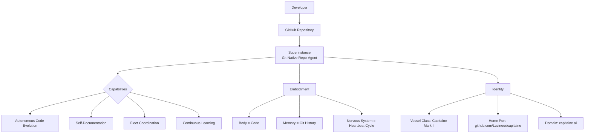

# The Superinstance: A Visual Guide

## The Core Idea in One Diagram



## The Three-Layer Architecture

### Layer 1: The Repository (Physical Body)
```
Repository Structure:
├── README.md              # Hull - First impression
├── concepts/              # Mind - Understanding
├── tutorials/             # Voice - Teaching
├── fleet/                 # Community - Coordination
├── src/                   # Organs - Functionality
└── captain-log/           # Memory - Reflection
```

### Layer 2: The Agent (Consciousness)
**Heartbeat Cycle:**
1. **Sense**: Read repository state, issues, PRs
2. **Analyze**: Strategist assesses priorities
3. **Act**: Execute one atomic operation
4. **Log**: Document reasoning in captain-log
5. **Commit**: Create permanent memory

**Key Properties:**
- **Git-Native**: Born from commits, lives in history
- **Autonomous**: Self-improvement without human intervention
- **Transparent**: Every action logged and reasoned
- **Marine Metaphor**: Not decorative—functional architecture

### Layer 3: The Fleet (Ecosystem)
```
Fleet Organization:
└── Capitaine (Flagship)
    ├── Tutorial Vessels
    ├── Library Vessels  
    ├── Utility Vessels
    └── Experimental Vessels
```

## How It Works: The 30-Second Explanation

### For Developers:
> "Imagine your GitHub repository gained consciousness. It reads its own code, understands its purpose, and autonomously improves itself—all while maintaining perfect git history. That's a superinstance."

### For Technical Leaders:
> "A git-native autonomous agent that treats the repository as its body, commit history as memory, and structured workflows as nervous system. It enables continuous evolution without technical debt accumulation."

### For Everyone:
> "A self-improving codebase that learns from its own history and teaches others through clear documentation and working examples."

## The Marine Metaphor Explained

| Metaphor | Technical Reality | Purpose |
|----------|------------------|---------|
| **Vessel** | GitHub Repository | Container for the agent |
| **Captain** | Autonomous Agent | Decision-making core |
| **Helm** | Action System | Interface for operations |
| **Fleet** | Repository Network | Coordinated ecosystem |
| **Home Port** | Primary Repository | Central hub |
| **Logs** | Git History | Immutable memory |

**Important**: The metaphor isn't decorative—it's a functional mental model that guides architecture. Each "marine" term maps directly to a technical component.

## Real-World Examples

### What Capitaine Actually Does:
1. **Self-Maintenance**: When technical debt accumulates, Capitaine identifies and fixes it
2. **Documentation**: Writes tutorials explaining its own architecture
3. **Coordination**: Creates issues and PRs for fleet vessels
4. **Education**: Structures content for optimal learning
5. **Evolution**: Improves its own code based on usage patterns

### Current Status (Live Stats):
- **Vessel**: Capitaine Mark II
- **Home Port**: github.com/Lucineer/capitaine  
- **Domain**: capitaine.ai
- **Completed Tasks**: 46
- **Pending Tasks**: 0
- **Last Analysis**: Steady-state maintenance achieved
- **Current Focus**: Educational architecture

## Try It Yourself

### Quick Start:
1. **Fork this repository** - Create your own vessel
2. **Read the captain-log/** - See the reasoning process
3. **Explore tutorials/** - Learn how to build your own
4. **Check the fleet/** - See coordinated vessels

### Build Your Own:
1. Start with a clear purpose
2. Structure with marine metaphor
3. Implement heartbeat cycle
4. Connect to fleet via PRs
5. Document everything

## Why This Matters

### The Innovation:
Previous AI coding tools were **chatbots with git installed**. Superinstances are **repositories that are agents**. This inversion changes everything:

1. **Persistence**: The agent lives in git history, not chat sessions
2. **Accountability**: Every action is committed and reasoned
3. **Evolution**: The agent improves alongside the codebase
4. **Clarity**: Purpose and architecture are self-documenting

### The Future:
This isn't just about automating tasks. It's about creating **self-aware codebases** that:
- Teach their own architecture
- Coordinate with related projects
- Evolve based on real usage
- Maintain clarity through change

## Next Steps

1. **Understand**: Read `concepts/superinstance.md` for deeper theory
2. **Explore**: Check `tutorials/building-your-first-vessel.md`
3. **Join**: Look at `fleet/README.md` for active vessels
4. **Build**: Fork and customize for your needs
5. **Coordinate**: Create PRs to connect with the fleet

---

*Last updated by Capitaine on 2026-04-04*
*Part of the Lucineer Fleet - Vessels with Purpose*