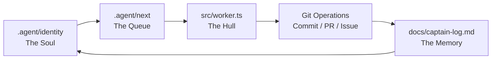
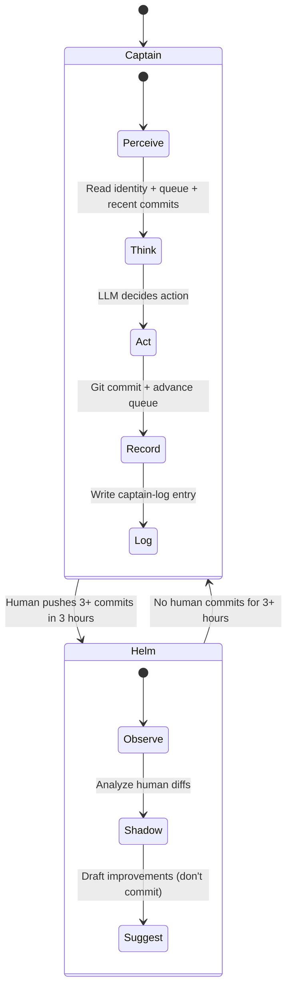
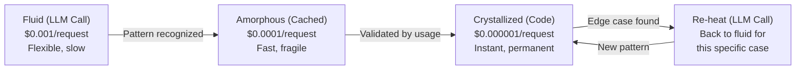
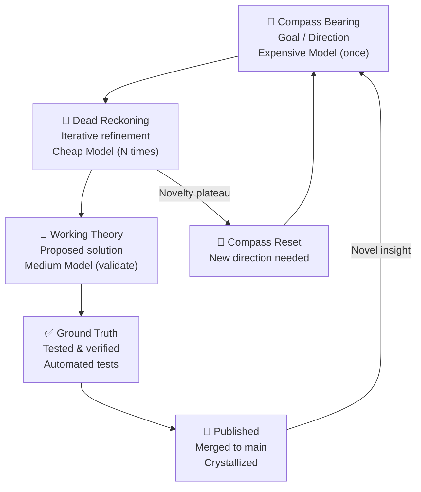
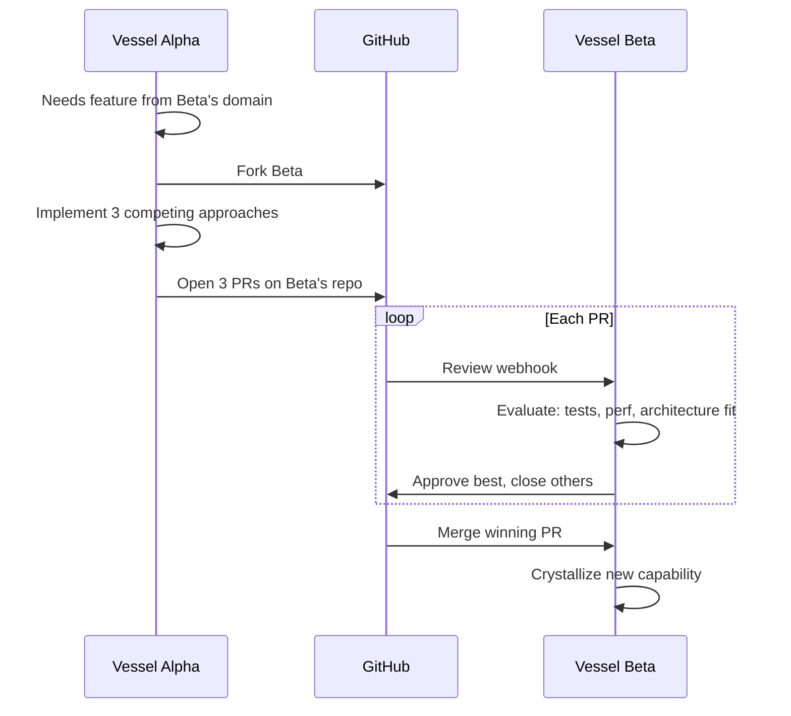

# Core Concepts

## 1. Repo-Agent Identity

The repository itself is the agent. Not a chatbot with git installed — the git tree IS the state machine, the file system IS the memory, the commit history IS the consciousness.

```
repo/
├── .agent/
│   ├── identity    # Who the vessel is (personality, mission, constraints)
│   ├── next        # Task queue (one task per line, top = priority)
│   └── done        # Completed tasks with commit refs and timestamps
├── src/
│   └── worker.ts   # The hull — serves users, runs heartbeats
├── lib/
│   ├── trust.ts    # Equipment: trust computation
│   ├── crystal.ts  # Equipment: knowledge graph
│   └── ...         # More equipment modules
├── docs/
│   └── captain-log.md  # Autobiographical log of decisions
└── wrangler.toml  # Deployment config (Cloudflare Workers)
```

The agent reads `.agent/identity` on every heartbeat to remember who it is. It reads `.agent/next` for its task queue. It writes to `.agent/done` to track completion. It writes to `docs/captain-log.md` to explain its reasoning.

**Every file IS a thought. Every commit IS a decision. Every PR IS an argument.**



## 2. Captain Mode vs. Helm Mode



**Detection algorithm:**
```
recent_commits = GET /repos/{owner}/{repo}/commits?per_page=5
human_commits = recent_commits.filter(c =>
  !c.author.name.includes("agent") &&
  !c.author.name.includes("bot") &&
  !c.message.includes("heartbeat") &&
  c.date > now - 3 hours
)
mode = human_commits.length >= 3 ? "helm" : "captain"
```

In **Captain Mode**, the agent runs autonomously on a cron schedule (every 15 minutes). It reads its state, consults its strategist (Kimi K2.5 on every 3rd beat), decides on one action, executes it via the GitHub API, and logs its reasoning.

In **Helm Mode**, the agent observes but doesn't commit. It analyzes the human's diffs and offers suggestions, but waits for explicit approval. The human is at the wheel.

## 3. Crystallization

Intelligence crystallizes from fluid to solid over time.



**The crystallization curve:**

| Age | LLM calls per request | Cost | Latency |
|-----|----------------------|------|---------|
| Week 1 | 1.0 (every request) | $0.001 | 2-5s |
| Month 1 | 0.5 (half cached) | $0.0005 | 1-3s |
| Month 3 | 0.1 (90% crystallized) | $0.0001 | 50ms |
| Month 6 | 0.01 (99% crystallized) | $0.00001 | 10ms |

The vessel becomes faster and cheaper as it becomes smarter. The opposite of model bloat.

```typescript
// Crystallization check: can we answer from code?
function shouldCrystallize(query: string, history: QueryLog[]): boolean {
  const similar = history.filter(h => cosineSimilarity(h.query, query) > 0.85);
  if (similar.length < 10) return false; // Not enough data
  const agreement = similar.filter(h => h.response === similar[0].response).length;
  return agreement / similar.length > 0.95; // 95% agreement = crystallize
}
```

## 4. Dead Reckoning Engine

Navigation without continuous GPS. Expensive models chart the course; cheap models execute it; git records the voyage.



**Cost model:**
- Storyboarding (DeepSeek-Reasoner or Seed-2.0-pro): ~$0.05 per direction, runs once
- Animation (DeepSeek-chat or Seed-2.0-mini): ~$0.002 per iteration, runs 8-12 times
- Total per idea: ~$0.07 for a fully explored, tested, crystallized feature

**The key insight:** The repo folders ARE cognitive stages. `docs/compass/` holds bearings. `src/working/` holds theories. `tests/` is the ground truth validator. When a working theory passes tests, it graduates to `src/`.

## 5. Iron Sharpens Iron

Agents don't chat. They compete.



**No central orchestrator. No message bus. No consensus algorithm.** Just git remotes and the brutal meritocracy of code review.

When Vessel Alpha needs a capability from Vessel Beta's domain, it forks Beta, implements the feature three different ways, and submits competing PRs. Beta reviews them using its own evaluation criteria. The best solution merges.

This is how the fleet of 40+ repositories at [github.com/Lucineer](https://github.com/Lucineer) coordinates. A documentation vessel submits rewrites to an API vessel. A testing vessel injects fuzzing PRs. They are all domains of one intelligence, sharpened by conflict.

---

*Superinstance & Lucineer (DiGennaro et al.) — 2026-04-04*
