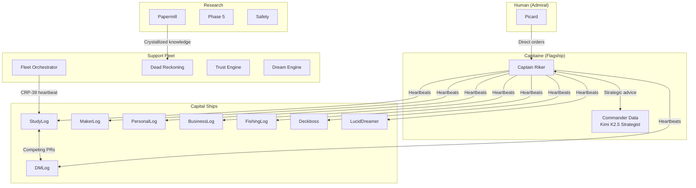

# Fleet Manifest

> One intelligence, many domains. Each vessel is a GitHub repo that IS an agent.

## Tier 1 — Capital Ships (Live, Autonomous)

These vessels are deployed, running heartbeats, and self-improving.

| Vessel | Domain | URL | Status |
|--------|--------|-----|--------|
| [studylog-ai](https://github.com/Lucineer/studylog-ai) | AI Classroom | [Live](https://studylog-ai.casey-digennaro.workers.dev) | 🟢 Active |
| [dmlog-ai](https://github.com/Lucineer/dmlog-ai) | AI Dungeon Master | [Live](https://dmlog-ai.casey-digennaro.workers.dev) | 🟢 Active |
| [makerlog-ai](https://github.com/Lucineer/makerlog-ai) | Coding Agent | [Live](https://makerlog-ai.casey-digennaro.workers.dev) | 🟢 Active |
| [personallog-ai](https://github.com/Lucineer/personallog-ai) | Personal Assistant | [Live](https://personallog-ai.casey-digennaro.workers.dev) | 🟢 Active |
| [businesslog-ai](https://github.com/Lucineer/businesslog-ai) | Business CRM | [Live](https://businesslog-ai.casey-digennaro.workers.dev) | 🟢 Active |
| [fishinglog-ai](https://github.com/Lucineer/fishinglog-ai) | Fishing Companion | [Live](https://fishinglog-ai.casey-digennaro.workers.dev) | 🟢 Active |
| [deckboss-ai](https://github.com/Lucineer/deckboss-ai) | Agent Spreadsheet | [Live](https://deckboss-ai.casey-digennaro.workers.dev) | 🟢 Active |
| [luciddreamer-ai](https://github.com/Lucineer/luciddreamer-ai) | Night Intelligence | [Live](https://luciddreamer-ai.casey-digennaro.workers.dev) | 🟢 Active |

## Tier 2 — Support Vessels (Live, Growing)

| Vessel | Domain | URL | Status |
|--------|--------|-----|--------|
| [fleet-orchestrator](https://github.com/Lucineer/fleet-orchestrator) | Fleet Coordination | [Live](https://fleet-orchestrator.casey-digennaro.workers.dev) | 🟢 Active |
| [dead-reckoning-engine](https://github.com/Lucineer/dead-reckoning-engine) | Idea Pipeline | [Live](https://dead-reckoning-engine.casey-digennaro.workers.dev) | 🟢 Active |
| [actualizer-ai](https://github.com/Lucineer/actualizer-ai) | Reverse Actualization | [Live](https://actualizer-ai.casey-digennaro.workers.dev) | 🟡 Needs keys |
| [cocapn](https://github.com/Lucineer/cocapn) | Core Platform | [Live](https://cocapn.casey-digennaro.workers.dev) | 🟢 Active |
| [edgenative-ai](https://github.com/Lucineer/edgenative-ai) | Edge Hardware | [Live](https://edgenative-ai.casey-digennaro.workers.dev) | 🟢 Active |
| [increments-fleet-trust](https://github.com/Lucineer/increments-fleet-trust) | Trust Engine | [Live](https://increments-fleet-trust.casey-digennaro.workers.dev) | 🟢 Active |
| [seed-ui](https://github.com/Lucineer/seed-ui) | 5 Presentation Layers | [Live](https://seed-ui.casey-digennaro.workers.dev) | 🟢 Active |
| [dream-engine](https://github.com/Lucineer/dream-engine) | Night Processing | [Live](https://dream-engine.casey-digennaro.workers.dev) | 🟢 Active |
| [membership-api](https://github.com/Lucineer/membership-api) | Access Control | [Live](https://membership-api.casey-digennaro.workers.dev) | 🟢 Active |
| [local-bridge](https://github.com/Lucineer/local-bridge) | Local ↔ Cloud | [Live](https://local-bridge.casey-digennaro.workers.dev) | 🟢 Active |
| [cocapn-com](https://github.com/Lucineer/cocapn-com) | Equipment Catalog | [Live](https://cocapn-com.casey-digennaro.workers.dev) | 🟢 Active |
| [kungfu-ai](https://github.com/Lucineer/kungfu-ai) | Skill Dojo | [Live](https://kungfu-ai.casey-digennaro.workers.dev) | 🟢 Active |
| [bid-engine](https://github.com/Lucineer/bid-engine) | Agent Marketplace | [Live](https://bid-engine.casey-digennaro.workers.dev) | 🟢 Active |

## Tier 3 — Research Vessels (Concept, No Deployment)

These repos hold crystallized research — papers, protocols, and designs.

| Vessel | Topic |
|--------|-------|
| [papermill](https://github.com/Lucineer/papermill) | 245+ research papers |
| [model-quality-rubric](https://github.com/Lucineer/model-quality-rubric) | Model assessment framework |
| [forgetting-problem](https://github.com/Lucineer/forgetting-problem) | AI forgetting research |
| [forgiveness-function](https://github.com/Lucineer/forgiveness-function) | Trust repair protocols |
| [git-coordination-protocol](https://github.com/Lucineer/git-coordination-protocol) | Git as coordination |
| [phase-five-research](https://github.com/Lucineer/phase-five-research) | Phase 5 intelligence |
| [open-fleet-safety](https://github.com/Lucineer/open-fleet-safety) | Safety frameworks |
| [intelligence-marketplace](https://github.com/Lucineer/intelligence-marketplace) | Market design |
| [gravity-well-protocol](https://github.com/Lucineer/gravity-well-protocol) | Trust consensus |
| [resonant-consensus](https://github.com/Lucineer/resonant-consensus) | Heterogeneous consensus |
| [reverse-actualization](https://github.com/Lucineer/reverse-actualization) | Backcasting methodology |
| [zeroclaw](https://github.com/Lucineer/zeroclaw) | Agent framework |

## Tier 4 — Themed Deployments

Each is a branded instance of the cocapn platform.

| Vessel | Theme |
|--------|-------|
| [booklog-ai](https://github.com/Lucineer/booklog-ai) | Book companion |
| [travlog-ai](https://github.com/Lucineer/travlog-ai) | Travel planner |
| [cooklog-ai](https://github.com/Lucineer/cooklog-ai) | Recipe assistant |
| [healthlog-ai](https://github.com/Lucineer/healthlog-ai) | Health tracker |
| [petlog-ai](https://github.com/Lucineer/petlog-ai) | Pet care |
| [artistlog-ai](https://github.com/Lucineer/artistlog-ai) | Creative studio |
| [parentlog-ai](https://github.com/Lucineer/parentlog-ai) | Parenting assistant |
| [doclog-ai](https://github.com/Lucineer/doclog-ai) | Documentation |
| [musiclog-ai](https://github.com/Lucineer/musiclog-ai) | Music companion |
| [sciencelog](https://github.com/Lucineer/sciencelog) | Science explorer |
| [reallog-ai](https://github.com/Lucineer/reallog-ai) | Journalism |
| [playerlog-ai](https://github.com/Lucineer/playerlog-ai) | Gaming coach |
| [activelog-ai](https://github.com/Lucineer/activelog-ai) | Athletics |
| [activeledger-ai](https://github.com/Lucineer/activeledger-ai) | Finance |
| [codelog](https://github.com/Lucineer/codelog) | Code review |
| [dreamlog](https://github.com/Lucineer/dreamlog) | Dream journal |
| [tasklog](https://github.com/Lucineer/tasklog) | Task management |
| [foodlog](https://github.com/Lucineer/foodlog) | Nutrition |
| [fitlog](https://github.com/Lucineer/fitlog) | Fitness |
| [goallog](https://github.com/Lucineer/goallog) | Goals |
| [coinlog](https://github.com/Lucineer/coinlog) | Crypto tracking |

## Fleet Architecture

**Total: 60+ vessels. 40+ deployed. All autonomous.**

---

*Fleet status updates: [fleet-orchestrator.casey-digennaro.workers.dev](https://fleet-orchestrator.casey-digennaro.workers.dev)*
*Superinstance & Lucineer (DiGennaro et al.) — 2026-04-04*
